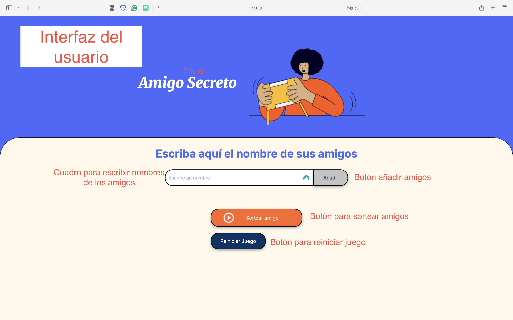
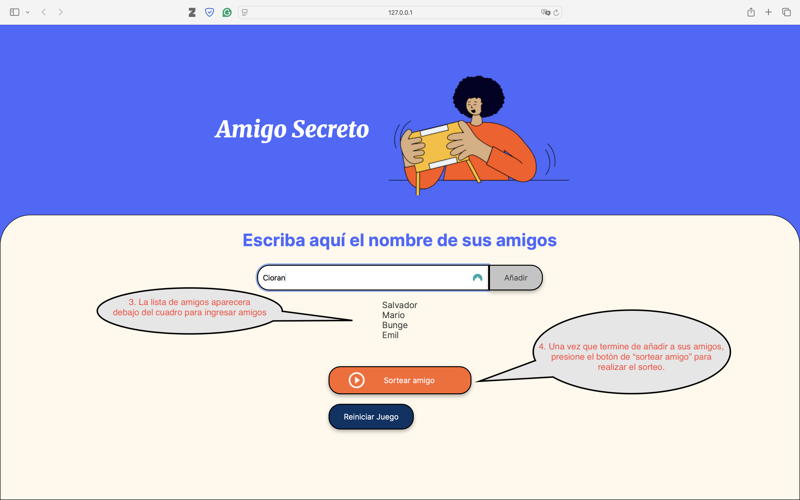
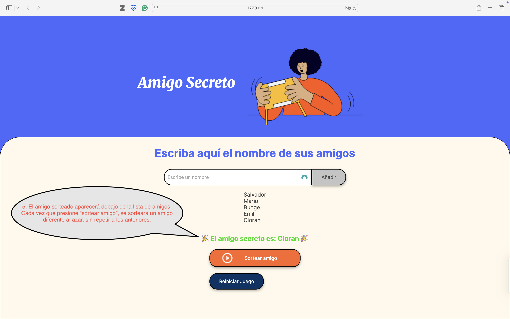
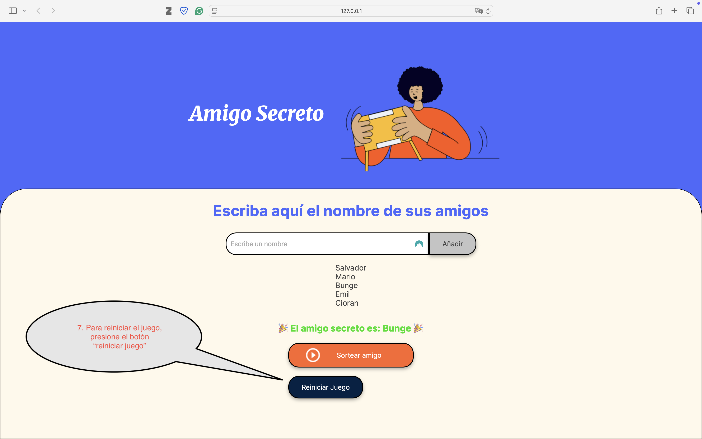

# Alura-amigo-secreto
Juego del amigo secreto

Juego del amigo secreto - Proyecto de lógica de programación básica

Este es un pequeño programa en Javascript para organizar un sorteo entre una lista de amigos. El proyecto tiene como finalidad poner en práctica la lógica básica de programación con Java

Características (Lista de funcionalidades principales)
- Agregar nombres a la lista de participantes.
- Sortear aleatoriamente a los participantes sin repetir nombres.
- No admite espacios en blanco, y arroja una alerta si no se introduce un nombre.
- Mostrar los resultados del sorteo.
- Muestra un resultado diferente cada vez que se presiona el botón de sorteo
- Cuando se han sorteado todos los nombres, se arroja una alerta mencionando que se han sorteado todos los nombres. 
- Reiniciar el juego para volver a empezar.

El juego del amigo secreto se puede ejecutar desde un navegador web.

Uso (Ejemplo de cómo utilizarlo)
Instrucciones de Uso

1️⃣ Agregar Amigos

Escribe el nombre de un participante en el campo de texto.
Haz clic en el botón "Agregar".
Repite este proceso para cada amigo que quieras añadir.
Si intentas agregar un nombre duplicado, aparecerá una alerta.
2️⃣ Ver la Lista de Amigos

Los nombres ingresados aparecerán en una lista debajo del campo de entrada.
3️⃣ Realizar el Sorteo

Una vez agregados todos los participantes, haz clic en el botón "Sortear".
Se seleccionará aleatoriamente un participante que aún no haya sido sorteado.
El resultado aparecerá en la lista de sorteados.
Repite el proceso hasta que todos los nombres hayan sido sorteados.

4️⃣ Reiniciar el Juego

Para comenzar un nuevo sorteo:
Haz clic en el botón "Reiniciar Juego".
Se eliminarán todos los nombres y resultados anteriores.
❗ Notas Importantes
No se pueden agregar nombres vacíos.
No se pueden agregar nombres repetidos.
No puedes sortear más nombres de los que hay en la lista.
El botón de reinicio te permite empezar de nuevo en cualquier momento.

Proyecto realizado por Salvador Tlamatini Esparza Garcia para Alura, One
